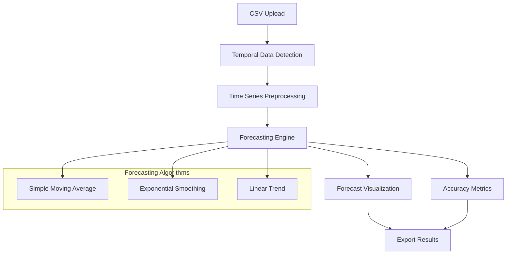

# Time Series Forecasting Design Document

## Overview

The time series forecasting feature extends NetCraft AI with temporal data analysis capabilities, implementing three core forecasting algorithms: Simple Moving Average, Exponential Smoothing, and Linear Trend. The design follows the existing architecture patterns with pure TypeScript implementations in `src/lib/`, React components for UI, and comprehensive type definitions. The feature integrates seamlessly with the current data upload pipeline and maintains the application's client-side philosophy.

## Architecture

### High-Level Architecture



### Data Flow

1. **Data Ingestion**: Extend existing CSV parser to detect datetime columns
2. **Preprocessing**: Handle missing values, irregular intervals, and data validation
3. **Algorithm Selection**: User chooses forecasting method and configures parameters
4. **Training/Fitting**: Algorithm processes historical data to learn patterns
5. **Prediction**: Generate future forecasts with confidence intervals
6. **Evaluation**: Calculate accuracy metrics on validation data
7. **Visualization**: Display results using Chart.js integration
8. **Export**: Save models and predictions in JSON/CSV formats

## Components and Interfaces

### Core Library Structure

```
src/lib/forecasting/
├── forecasting-engine.ts      # Main forecasting orchestrator
├── algorithms/
│   ├── moving-average.ts      # Simple Moving Average implementation
│   ├── exponential-smoothing.ts  # Exponential Smoothing implementation
│   └── linear-trend.ts        # Linear Trend implementation
├── preprocessing/
│   ├── temporal-parser.ts     # Date/time parsing and validation
│   ├── data-cleaner.ts        # Handle missing values and outliers
│   └── resampling.ts          # Time series resampling utilities
├── metrics/
│   └── forecast-metrics.ts    # MAE, RMSE, MAPE calculations
└── __tests__/
    ├── forecasting-engine.test.ts
    ├── moving-average.test.ts
    ├── exponential-smoothing.test.ts
    └── linear-trend.test.ts
```

### React Components Structure

```
src/components/Forecasting/
├── ForecastingForm.tsx        # Algorithm selection and configuration
├── ForecastingResults.tsx     # Results display and visualization
├── TimeSeriesChart.tsx        # Interactive time series visualization
├── MetricsPanel.tsx           # Accuracy metrics display
├── ForecastExport.tsx         # Export functionality
└── __tests__/
    ├── ForecastingForm.test.tsx
    └── ForecastingResults.test.tsx
```

### Type Definitions

```typescript
// Add to src/types.d.ts

export interface TimeSeriesData {
  timestamps: Date[];
  values: number[];
  metadata: {
    frequency: 'daily' | 'weekly' | 'monthly' | 'irregular';
    hasGaps: boolean;
    totalPoints: number;
  };
}

export interface ForecastConfig {
  method: 'moving-average' | 'exponential-smoothing' | 'linear-trend';
  parameters: {
    // Moving Average
    windowSize?: number;
    
    // Exponential Smoothing
    alpha?: number;
    beta?: number;
    gamma?: number;
    seasonalPeriods?: number;
    
    // Linear Trend
    polynomialDegree?: number;
  };
  forecastHorizon: number;
  trainTestSplit: number;
  confidenceLevel: number;
}

export interface ForecastResult {
  method: string;
  fittedValues: number[];
  predictions: number[];
  confidenceIntervals: {
    lower: number[];
    upper: number[];
  };
  metrics: {
    mae: number;
    rmse: number;
    mape: number;
    r2?: number;
  };
  timestamps: {
    historical: Date[];
    forecast: Date[];
  };
}

export interface ForecastModel {
  config: ForecastConfig;
  result: ForecastResult;
  trained: boolean;
  trainingData: TimeSeriesData;
  createdAt: Date;
}
```

## Data Models

### Temporal Data Detection

The system will extend the existing `DataColumn` type detection to identify datetime columns:

```typescript
// Enhanced column type detection
export function detectColumnTypes(data: Record<string, any>[]): DataColumn[] {
  // Existing logic + datetime detection
  const datePatterns = [
    /^\d{4}-\d{2}-\d{2}$/,           // YYYY-MM-DD
    /^\d{2}\/\d{2}\/\d{4}$/,         // MM/DD/YYYY
    /^\d{4}-\d{2}-\d{2}T\d{2}:\d{2}/ // ISO datetime
  ];
  
  // Enhanced detection logic for temporal columns
}
```

### Time Series Preprocessing

```typescript
export class TimeSeriesPreprocessor {
  static parseTimestamps(column: any[]): Date[] {
    // Parse various date formats
    // Handle timezone considerations
    // Validate chronological order
  }
  
  static handleMissingValues(
    data: TimeSeriesData, 
    method: 'interpolate' | 'forward-fill' | 'drop'
  ): TimeSeriesData {
    // Implement missing value strategies
  }
  
  static resample(
    data: TimeSeriesData,
    frequency: 'daily' | 'weekly' | 'monthly'
  ): TimeSeriesData {
    // Aggregate data to specified frequency
  }
}
```

### Forecasting Algorithms

#### Simple Moving Average
```typescript
export class MovingAverageForecaster {
  private windowSize: number;
  
  fit(data: number[]): void {
    // Calculate moving averages for historical data
  }
  
  predict(horizon: number): ForecastResult {
    // Generate predictions using moving average
    // Calculate confidence intervals based on historical variance
  }
}
```

#### Exponential Smoothing
```typescript
export class ExponentialSmoothingForecaster {
  private alpha: number;
  private beta?: number;  // For trend
  private gamma?: number; // For seasonality
  
  fit(data: number[], seasonalPeriods?: number): void {
    // Implement Holt-Winters exponential smoothing
    // Support simple, double, and triple exponential smoothing
  }
  
  predict(horizon: number): ForecastResult {
    // Generate forecasts with trend and seasonal components
  }
}
```

#### Linear Trend
```typescript
export class LinearTrendForecaster {
  private coefficients: number[];
  
  fit(data: number[]): void {
    // Implement least squares regression
    // Support polynomial trends
  }
  
  predict(horizon: number): ForecastResult {
    // Extrapolate trend into future
    // Calculate prediction intervals
  }
}
```

## Error Handling

### Data Validation
- **Invalid Timestamps**: Graceful handling of unparseable dates with user feedback
- **Insufficient Data**: Minimum data requirements for each forecasting method
- **Missing Values**: Multiple strategies with user choice
- **Irregular Intervals**: Automatic detection and resampling options

### Algorithm Robustness
- **Numerical Stability**: Prevent overflow/underflow in calculations
- **Parameter Validation**: Ensure valid ranges for all algorithm parameters
- **Convergence Issues**: Timeout mechanisms for iterative algorithms
- **Edge Cases**: Handle constant series, single data points, etc.

### User Experience
- **Progress Indicators**: Real-time feedback during processing
- **Error Messages**: Clear, actionable error descriptions
- **Fallback Options**: Alternative approaches when primary method fails
- **Validation Warnings**: Alert users to potential data quality issues

## Testing Strategy

### Unit Tests
- **Algorithm Accuracy**: Test against known datasets with expected results
- **Edge Cases**: Boundary conditions, empty data, single points
- **Parameter Validation**: Invalid inputs and error handling
- **Numerical Precision**: Floating-point accuracy and stability

### Integration Tests
- **End-to-End Workflow**: Complete forecasting pipeline from upload to export
- **Component Integration**: React components with forecasting engine
- **Data Format Compatibility**: Various CSV formats and date representations
- **Performance**: Large datasets and computational efficiency

### Test Data
- **Synthetic Series**: Generated data with known patterns (trend, seasonal, noise)
- **Real-World Examples**: Economic indicators, weather data, sales figures
- **Edge Cases**: Missing values, irregular intervals, outliers
- **Demo Datasets**: Pre-loaded examples for user exploration

### Performance Benchmarks
- **Algorithm Speed**: Execution time for various data sizes
- **Memory Usage**: Efficient handling of large time series
- **Browser Compatibility**: Cross-browser performance validation
- **Responsiveness**: UI remains interactive during processing

## Integration Points

### Existing Data Pipeline
- Extend `csv-utils.ts` for temporal column detection
- Integrate with current `Dataset` and `DataColumn` interfaces
- Reuse existing normalization and validation patterns

### Visualization System
- Leverage existing Chart.js integration
- Extend chart types for time series with confidence intervals
- Maintain consistent styling and interaction patterns

### Export System
- Follow existing JSON serialization patterns for model persistence
- Extend CSV export to include forecast metadata
- Integrate with current project state management

### Navigation and Routing
- Add new route for forecasting page
- Update navigation components
- Maintain consistent page layout and styling patterns